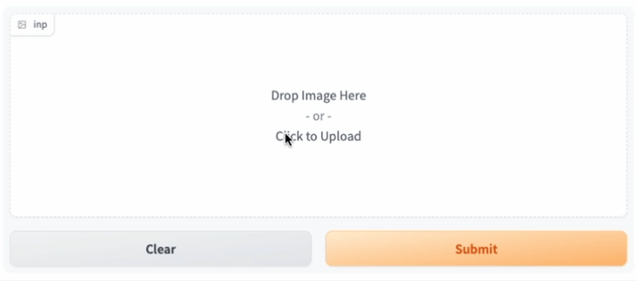

<div align="center">

# Gradio Box

This is the advanced gradio used in our paper, [](). which 
This is an extension to official [gradio](https://gradio.app/), which supports drawing boxes on top of an image.
This feature is requested in https://github.com/gradio-app/gradio/issues/2316.


</div>


## Usage

See mini-demo:
```
python app_box.py
```


## Install

### 1. Install Node.js

We install it on Ubuntu with:

```
curl -o- https://raw.githubusercontent.com/nvm-sh/nvm/v0.39.3/install.sh | bash

source ~/.bashrc # or ~/.zshrc based on which one you use

nvm install v18.16.0
```


### 2. Install ppnm

```
curl -fsSL https://get.pnpm.io/install.sh | sh -

source ~/.bashrc # or ~/.zshrc based on which one you use

pnpm --version  # check if success
```

### 3. Install gradio

```
git clone https://github.com/ShoufaChen/gradio-dev.git

cd gradio-dev

bash scripts/build_frontend.sh

pip install -e .
```


## Common Installation Issues


<details>
<summary>
 ERR_PNPM_FETCH_404  GET https://packagecloud.io/github/git-lfs/npm/whatwg-url/-/whatwg-url-5.0.0.tgz: Not Found - 404
No authorization header was set for the request.
</summary>
<br/>
https://github.com/pnpm/pnpm/issues/2933#issuecomment-975886322

```
# Add following in `~/.npmrc` file
@OWNER:registry=https://packagecloud.io/github/git-lfs/npm/
```

</details>


<details>
<summary>
ERROR: File "setup.py" not found. Directory cannot be installed in editable mode:
</summary>
<br/>
Use pip version >= 23.0.1

</details>


## Acknowledgement

Our implementation is mainly inspired by https://github.com/gradio-app/gradio/pull/3220, with several modifications for latest gradio.
Greate thanks to [CtrlAltDeplete](https://github.com/CtrlAltDeplete).
